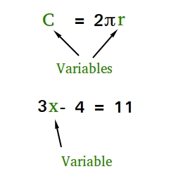

# variabelen
## Wat zijn variabelen
fgfchgchbcg
## Waarom gebruiken we variabelen
cxgfgfch
## declareren van variabelen <span style='background-color: #ffeded; color: #d32626; padding: 0px 5px 5px 5px; border-radius: 5px;'>expert</span>

<span class=".label-warning">test</span>
```java
int number = 10;
```



> test

> rename file without space's
[!file](variables.pdf)